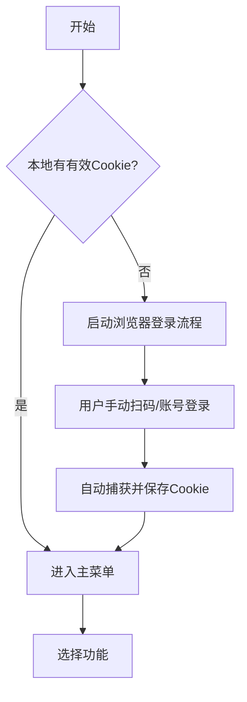
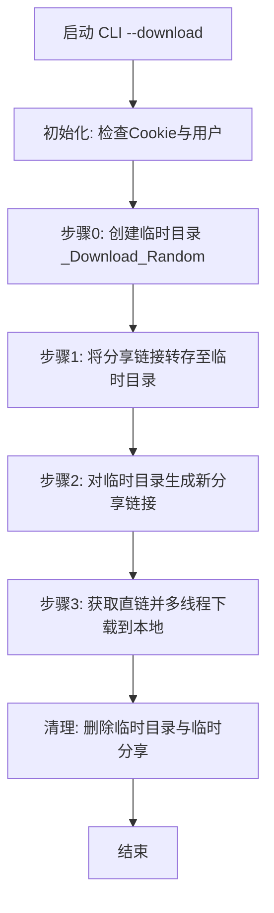
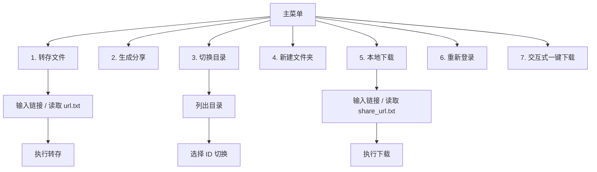

# 项目的需求与详细技术实现方案

## 快速概览

- **项目名称**：QuarkPanTool
- **目标**：提供批量转存、批量分享、批量下载及“一键下载”自动化，减少人工操作并提升下载体验
- **技术栈**：Python 3.11、httpx、playwright、tqdm、prettytable
- **代码入口**：[quark.py](file:///e:/_python_work/QuarkPanTool/quark.py)

## 快速开始

### 1. 启动交互菜单

```bash
python quark.py
```

启动后按照屏幕提示输入数字选择功能。

### 2. 自动化一键下载

适合无人值守场景，自动完成“转存 -> 分享 -> 下载”全流程。

```bash
# 基础用法
python quark.py --download "https://pan.quark.cn/s/abcd?pwd=123456"

# 指定 Cookie (首次运行时推荐，会自动保存到本地)
python quark.py --cookie "你的Cookie字符串" --download "https://pan.quark.cn/s/abcd?pwd=123456"

# 指定下载保存目录 (覆盖默认的 output/downloads)
python quark.py --download "https://pan.quark.cn/s/abcd" --path "D:\MyDownloads"
```

### 3. 批量操作

1. 将多个分享链接写入 `config/url.txt` (一行一个)。
2. 运行 `python quark.py`。
3. 选择菜单 `1` (批量转存) 或 `7` (批量一键下载，需自行在代码中扩展或循环调用 CLI)。

---

## 关键技术要点与算法说明

### 1. “一键下载”自动化原理

QuarkPanTool 的核心功能是通过自动化流水线，将“他人分享的文件”转换为“本地文件”。其关键在于绕过夸克网盘对普通分享链接的下载限制（通常需要转存到自己网盘后才能下载）。

**工作流程 (Pipeline Algorithm)**：

1.  **临时容器创建**：在用户网盘根目录下创建一个随机命名的临时文件夹（例如 `_Download_XyZ123`），用于隔离本次下载任务，避免污染用户现有的文件结构。
2.  **转存 (Save)**：调用转存 API，将目标分享链接中的文件保存到这个临时文件夹中。
3.  **自生成分享 (Self-Share)**：对临时文件夹中的内容，**再次生成一个新的分享链接**。
    - _原理_：夸克网盘允许用户下载自己生成的分享链接中的内容，或者下载自己网盘内的文件。通过生成分享链接，我们获得了一个指向该文件的、可控的下载入口。
4.  **直链获取与下载 (Get Link & Download)**：解析这个新的分享链接，获取文件的实际下载直链（Download URL）。
5.  **清理 (Cleanup)**：下载完成后，自动取消生成的分享链接，并删除临时文件夹。

### 2. 多线程分片下载算法

为了最大化利用带宽并绕过单连接速度限制，工具实现了基于 HTTP Range 的分片下载算法。

**分片策略**：

- **小文件 (< 100MB)**：使用单线程流式下载，避免建立连接的开销大于传输收益。
- **大文件 (>= 100MB)**：
  1.  **预分配空间**：首先在磁盘上创建一个与目标文件大小一致的空文件（使用 `truncate`）。
  2.  **分片计算**：
      ```python
      part_size = file_size // thread_count
      # 最后一个分片包含剩余所有字节
      end = (i + 1) * part_size - 1 if i < last else file_size - 1
      ```
  3.  **并发请求**：启动 `thread_count` 个异步任务（Asyncio Task），每个任务在 HTTP Header 中携带 `Range: bytes=start-end`。
  4.  **随机写入**：每个任务使用 `rb+` 模式打开文件，通过 `seek(start)` 定位到对应偏移量进行写入。

### 3. 绕过夸克客户端限制的关键

- **User-Agent 伪装**：
  - 普通请求使用标准的浏览器 UA。
  - **关键点**：当下载 API 返回 `code == 23018` (通常通过 UA 识别拦截) 时，工具会自动切换为 **Electron 客户端 UA** (`quark-cloud-drive/2.5.56...`)，伪装成官方 PC 客户端发起请求，从而成功获取下载链接。
- **Cookie 保活**：
  - 使用 `playwright` 模拟真实浏览器登录获取 Cookie，包含 `__kps`, `__ktd` 等关键加密字段，比单纯复制 Cookie 字符串更稳定。

---

## 用户体验流程图

### A. 首次使用与登录



### B. 一键下载自动化流程 (--download)



### C. 交互式菜单操作



---

## 详细配置参数说明

配置文件位于 `config/config.json`。
**注意**：`user`, `pdir_id`, `dir_name` 等状态信息已移至 `output/state.json`，`config.json` 仅保留静态配置。

| 参数字段              | 类型 | 默认值 | 说明                                                                                                                                        |
| :-------------------- | :--- | :----- | :------------------------------------------------------------------------------------------------------------------------------------------ |
| `thread_count`        | int  | 5      | **单文件**下载时的并发分片线程数。算法：`thread_count = file_size / (block_size * 1024 * 1024)`，但代码中目前有默认值与动态计算结合的逻辑。 |
| `multipart_threshold` | int  | 100    | 分片下载阈值(MB)。小于此大小的文件将使用单线程下载，大于此大小使用多线程。                                                                  |
| `concurrent_files`    | int  | 3      | **多文件**并行下载的数量。使用 `asyncio.Semaphore` 控制并发度，避免同时发起过多请求导致 IP 被封。                                           |

**运行时状态 (output/state.json)**:

- 自动生成，无需手动修改。
- 包含：`user` (当前登录用户), `pdir_id` (当前操作的网盘目录 ID), `dir_name` (目录名称)。

---

## 命令详细用法

### 1. 交互模式

直接运行不带参数：

```bash
python quark.py
```

- **功能 1 (分享地址转存文件)**:
  - 支持“批量”：自动读取 `config/url.txt`。
  - 支持“单个”：手动粘贴链接。
  - 作用：将别人的分享资源保存到你当前的 `pdir_id` 目录下。
- **功能 2 (批量生成分享链接)**:
  - 场景：你转存了一堆文件夹，现在想把它们分享出去（或者为了下载）。
  - 支持重试机制：失败的会记录到 `output/retry.txt`。
- **功能 3 (切换网盘保存目录)**:
  - 这是一个“状态切换”功能。
  - 输入 `0` 回到根目录。
  - 输入空值按回车，会列出当前目录下的文件夹供选择。
- **功能 5 (下载到本地)**:
  - 核心功能。支持断点续传（基于文件占位）。
  - 读取 `output/share_url.txt` (通常由功能 2 生成) 或手动输入。
- **功能 7 (一键下载他人分享链接)**:
  - 组合拳：内部按顺序执行 转存 -> 分享 -> 下载。
  - 适合手动处理单个复杂的分享链接。

### 2. 命令行模式 (CLI)

适合脚本调用或集成到其他系统。

**参数列表**:

| 参数         | 示例               | 说明                                                        |
| :----------- | :----------------- | :---------------------------------------------------------- |
| `--download` | `https://pan...`   | **必选** (用于触发自动化模式)。指定要下载的分享链接。       |
| `--path`     | `D:\Downloads`     | **可选**。指定本地下载保存路径。默认为 `output/downloads`。 |
| `--cookie`   | `"name=value;..."` | **可选**。指定本次运行使用的 Cookie，并更新到本地配置文件。 |

**常见场景**:

**场景一：首次运行，需要登录**

```bash
python quark.py
# 选择 6 进行登录，或按提示完成浏览器登录
```

**场景二：已有 Cookie，想直接下载某个资源到特定目录**

```bash
python quark.py --download "https://pan.quark.cn/s/shareid" --path "/home/user/downloads"
```

**场景三：批量脚本调用**
你可以编写一个 shell/python 脚本，循环调用本工具：

```bash
# bash example
urls=("https://pan.quark.cn/s/url1" "https://pan.quark.cn/s/url2")
for url in "${urls[@]}"; do
    python quark.py --download "$url"
done
```

---

## 目录结构说明

- **QuarkPanTool/** (项目根目录)
  - `quark.py`: 主程序
  - `quark_login.py`: 登录模块
  - `utils.py`: 工具函数
  - **config/** (配置目录)
    - `config.json`: 静态参数配置
    - `url.txt`: 待转存的链接列表
    - `cookies.txt`: 本地缓存的 Cookie
  - **output/** (输出目录 - **Git 忽略**)
    - `state.json`: 运行时状态(当前目录/用户)
    - `downloads/`: 默认下载文件存放区
    - `share_url.txt`: 生成的分享链接
    - `retry.txt`: 失败重试记录
    - `log/`: 运行日志

## 常见问题 (FAQ)

**Q: 为什么下载速度慢？**
A: 请检查 `config.json` 中的 `thread_count`。夸克对非会员可能有速度限制，多线程能提升一定速度，但受限于账号权益。

**Q: 出现 "Cookie 验证失败"？**
A: Cookie 已过期。请运行 `python quark.py` 选择功能 `6` 重新登录，或者使用 `--cookie` 参数传入最新 Cookie。

**Q: 临时目录没有删除怎么办？**
A: 程序在退出前会尝试清理 `_Download_xxx` 目录。如果发生异常导致未清理，你可以手动在网盘根目录删除这些文件夹，不影响后续使用。
